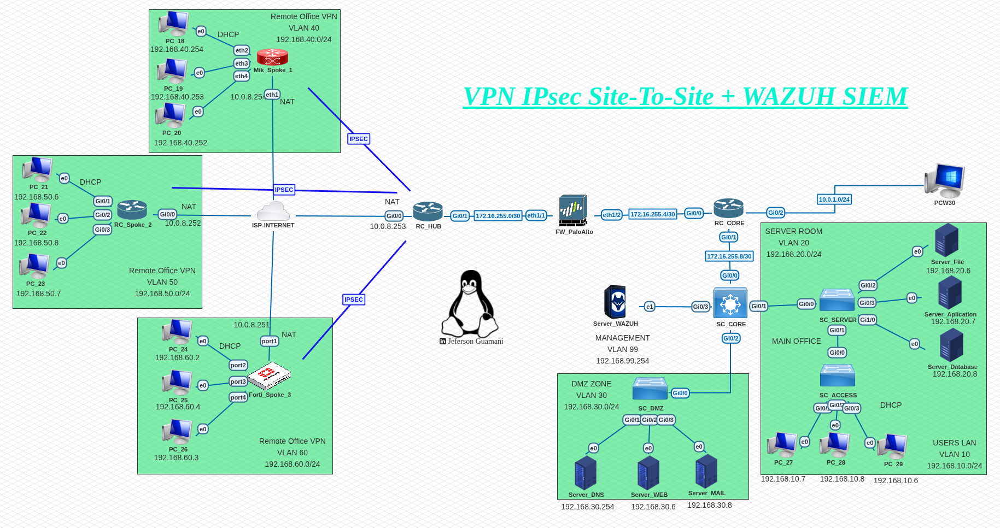
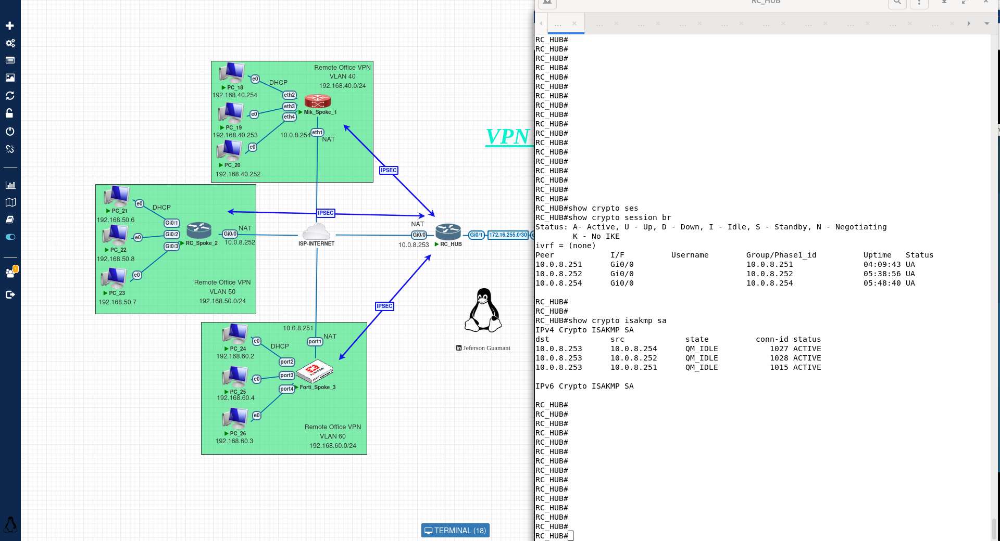
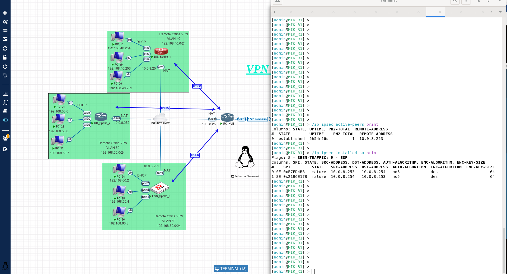

# Lab de Networking & Security – VPN IPsec + Wazuh SIEM

Comparto un escenario de laboratorio enfocado en seguridad y conectividad empresarial, implementando una arquitectura VPN IPsec Site-to-Site tipo Hub-and-Spoke, integrada con un sistema de monitoreo y detección basado en Wazuh SIEM.

## Topología del Laboratorio

🔐 VPN IPsec Site-to-Site (Hub & Spoke)

🌐 OSPF para enrutamiento interno

🔁 NAT (salida a internet en hub y spokes)

🧱 Segmentación mediante VLANs

🖧 SVI en core para DHCP

🔍 Wazuh SIEM (Manager + Indexer + Dashboard)

🧩 Entorno multi-vendor (Cisco, Fortinet, MikroTik, Palo Alto)

## Estado del túnel IPsec en Fortinet

Se observa que el túnel se encuentra en estado activo (up). Existe intercambio correcto de tráfico cifrado.
Los parámetros de fase 1 y fase 2 están correctamente establecidos. Esto confirma que el dispositivo Fortinet se integra exitosamente en la topología hub-and-spoke, estableciendo una conexión segura con el hub.

## Validación de seguridad IPsec en Cisco
Se observa las asociaciones de seguridad ISAKMP en estado QM_IDLE. Indicación de que la fase 1 se ha completado correctamente. Establecimiento exitoso del canal seguro entre peers. Esto evidencia que la negociación IKE se realizó sin errores.

Adicionalmente se observa el estado de sesiones IPsec en Cisco mediante el comando show crypto session sa que identifica las sesiones activas IPsec. Observando el estado UP-ACTIVE en los túneles.
Correspondencia correcta entre peers locales y remoto. Por lo tanto la VPN está operativa en tiempo real.

## Estado de IPsec en MikroTik (Peers activos)
Se observa los Peers activos establecidos, dirección IP del peer remoto (hub) y el estado estable de la conexión cconfirmando que MikroTik mantiene correctamente la fase 1 activa. Ademas se puede identificar las asociaciones de seguridad instaladas. Parámetros de cifrado activos.

