# Lab de Networking & Security – VPN IPsec + Wazuh SIEM

Comparto un escenario de laboratorio enfocado en seguridad y conectividad empresarial, implementando una arquitectura VPN IPsec Site-to-Site tipo Hub-and-Spoke, integrada con un sistema de monitoreo y detección basado en Wazuh SIEM.

## Topología del Laboratorio

🔐 VPN IPsec Site-to-Site (Hub & Spoke)

🌐 OSPF para enrutamiento interno

🔁 NAT (salida a internet en hub y spokes)

🧱 Segmentación mediante VLANs

🖧 SVI en core para DHCP

🔍 Wazuh SIEM (Manager + Indexer + Dashboard)

🧩 Entorno multi-vendor (Cisco, Fortinet, MikroTik, Palo Alto)

## Estado del túnel IPsec en Fortinet

Se observa que el túnel se encuentra en estado activo (up). Existe intercambio correcto de tráfico cifrado.
Los parámetros de fase 1 y fase 2 están correctamente establecidos. Esto confirma que el dispositivo Fortinet se integra exitosamente en la topología hub-and-spoke, estableciendo una conexión segura con el hub.

## Validación de seguridad IPsec en Cisco
Se observa las asociaciones de seguridad ISAKMP en estado QM_IDLE. Indicación de que la fase 1 se ha completado correctamente. Establecimiento exitoso del canal seguro entre peers. Esto evidencia que la negociación IKE se realizó sin errores.

Adicionalmente se observa el estado de sesiones IPsec en Cisco mediante el comando show crypto session sa que identifica las sesiones activas IPsec. Observando el estado UP-ACTIVE en los túneles.
Correspondencia correcta entre peers locales y remoto. Por lo tanto la VPN está operativa en tiempo real.

## Estado de IPsec en MikroTik (Peers activos)
Se observa los Peers activos establecidos, dirección IP del peer remoto (hub) y el estado estable de la conexión cconfirmando que MikroTik mantiene correctamente la fase 1 activa. Ademas se puede identificar las asociaciones de seguridad instaladas. Parámetros de cifrado activos.

## Estado del Servidor Wazuh

El sistema de información y gestión de eventos de seguridad Wazuh fue desplegado dentro del laboratorio de forma centralizada. Esto significa que sus tres componentes principales —Indexer, Manager y Dashboard— se encuentran instalados en un mismo servidor.

Para replicar este escenario, se recomienda que durante el proceso de instalación se utilice el dominio del servidor en lugar de la dirección IP(Seguir los pasos a detalle de su pagina oficial). Esto se debe a que la IP puede cambiar al momento de crear un nuevo entorno, mientras que el dominio ofrece mayor estabilidad y facilidad de configuración.

En caso de ser necesario realizar ajustes, basta con actualizar la dirección IP en el archivo /etc/hosts, reemplazándola por el dominio y la IP actualmente en uso. Una vez realizada esta modificación, es recomendable reiniciar los servicios para que los cambios se apliquen correctamente.

En las siguientes imágenes se puede observar el funcionamiento adecuado de los tres componentes del sistema.

- [x] Funcionamiento Indexer
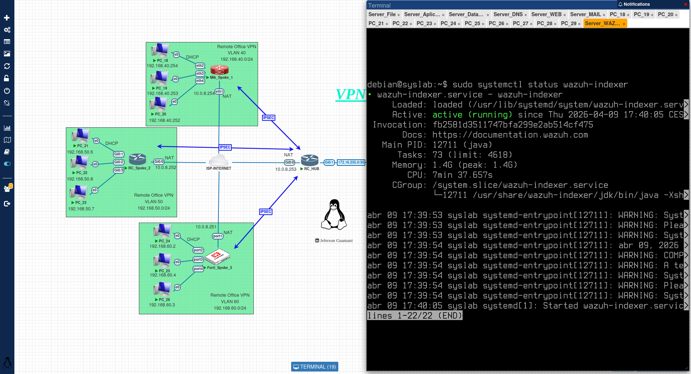
- [x] Funcionamiento Manager
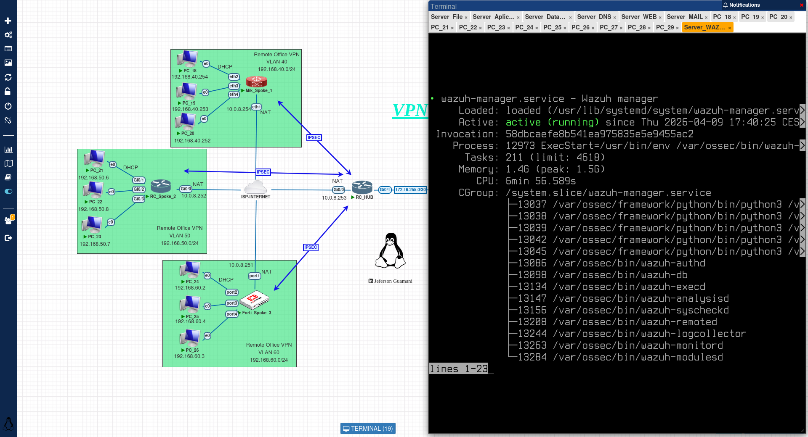
- [x] Funcionamiento Dashboard
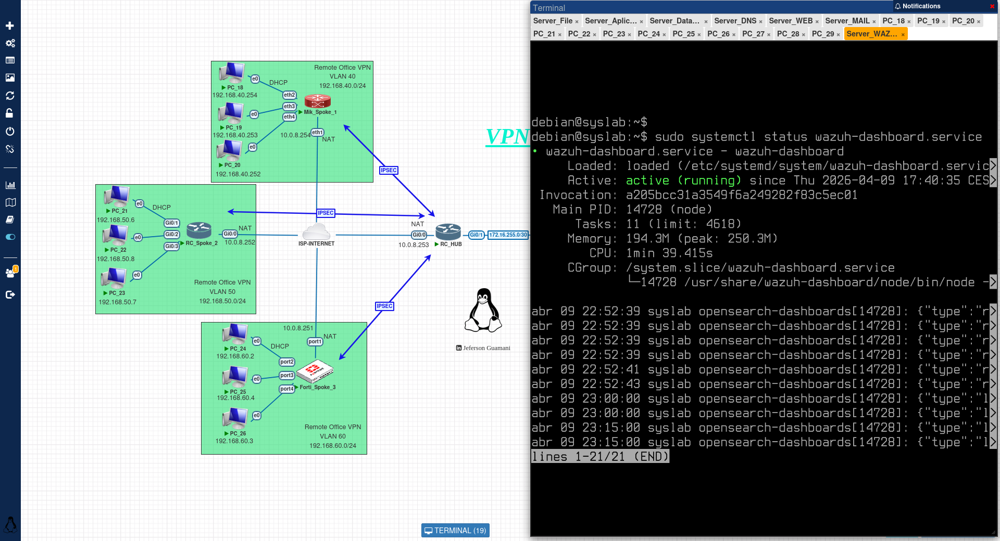

## Estado del Agente 

En el caso de los hosts, se recomienda que cada dispositivo cuente con un nombre único que permita su correcta identificación dentro de la red. En sistemas Linux, este cambio puede realizarse fácilmente mediante el comando systemctl set-hostname <nuevo_nombre>. Asimismo, es necesario actualizar el archivo /etc/hostname para mantener la consistencia en la configuración del sistema.

Asignar nombres de host únicos facilita la administración, el monitoreo y la correlación de eventos dentro de plataformas como Wazuh.

Adicional se recomienda verificar que la IP del servidor fue asignada correctamente, para lo cual verificar en la ruta /var/ossec/etc/ossec.conf y verificar los logs del agente mediante /var/ossec/log/ossec.logs.

En la siguiente imagen se puede observar el correcto funcionamiento del agente tras la configuración realizada.

- [x] Funcionamiento Agente
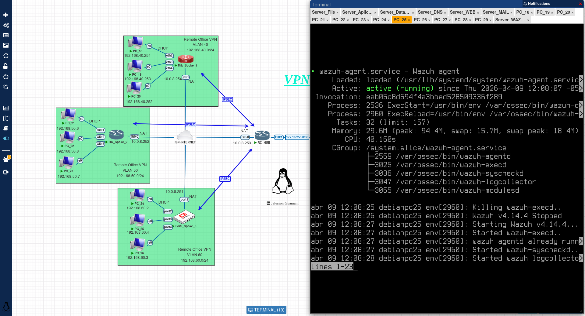

## Funcionamiento VPN - DNS - WEB

En el laboratorio también se implementó un servidor DNS recursivo y un servidor web, integrados mediante una conexión VPN de tipo IPsec. A través de esta configuración, se puede observar que desde un cliente, utilizando el comando nslookup, la resolución de nombres de dominio funciona correctamente para las páginas internas de la empresa.

Asimismo, al realizar una consulta nslookup a Google, se evidencia que el servidor DNS recursivo opera de manera adecuada, ya que devuelve la dirección IP correspondiente.

Por otro lado, se puede comprobar que el sitio web corporativo alojado en el servidor —netlab-demo.com— se carga correctamente. Esto demuestra que el tráfico entre las oficinas remotas y la oficina central a través de la VPN funciona de manera óptima.

En consecuencia, se garantiza que los usuarios de las oficinas remotas mantengan acceso tanto a los servicios internos como a internet, asegurando que el uso de la VPN IPsec de tipo site-to-site sea transparente e imperceptible para el usuario final.

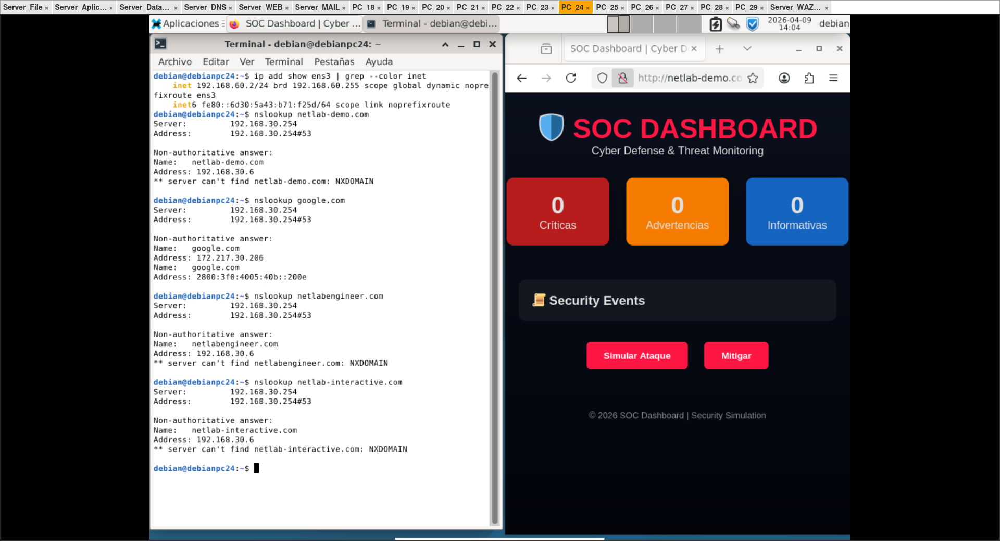

## Funcionamiento Servidor Wazuh

Si se desea administrar el servidor desde el host anfitrión, se recomienda deshabilitar el NAT en el router hub y configurar una ruta estática en el host anfitrion hacia la red donde se encuentra el servidor de Wazuh.

En sistemas Linux, esto puede realizarse mediante el comando:
ip route add 192.168.99.0/24 dev <interfaz> via <gateway>

Mientras que en sistemas Windows se puede configurar con:
route -p add 192.168.99.0 mask 255.255.255.0 <gateway>

Con esta configuración, será posible administrar el servidor directamente desde el host anfitrión. En caso contrario, la administración deberá realizarse desde un equipo que se encuentre dentro del mismo escenario de red.

En la siguiente imagen se puede observar que los 18 agentes Linux y el agente Windows se encuentran activos y correctamente conectados al sistema.

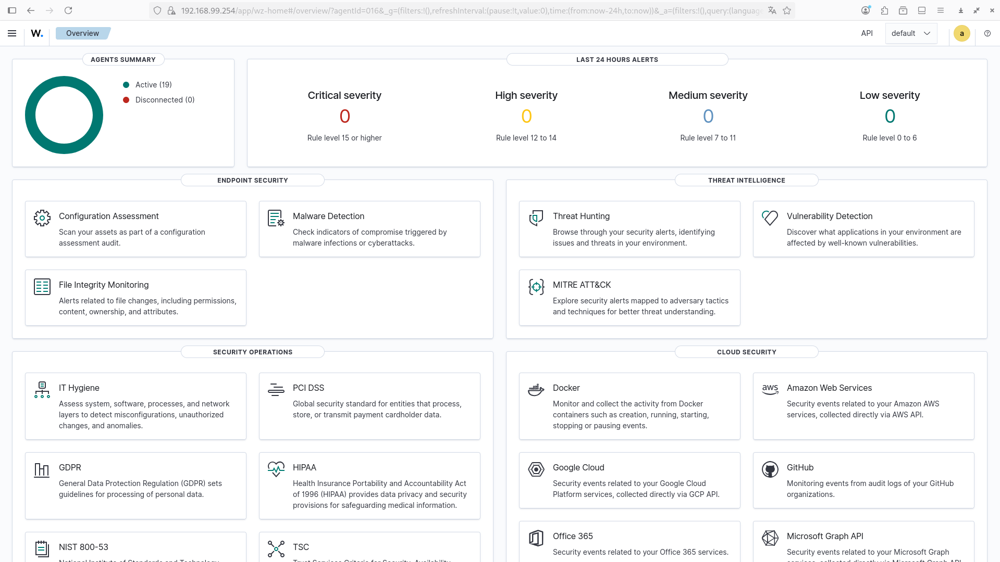

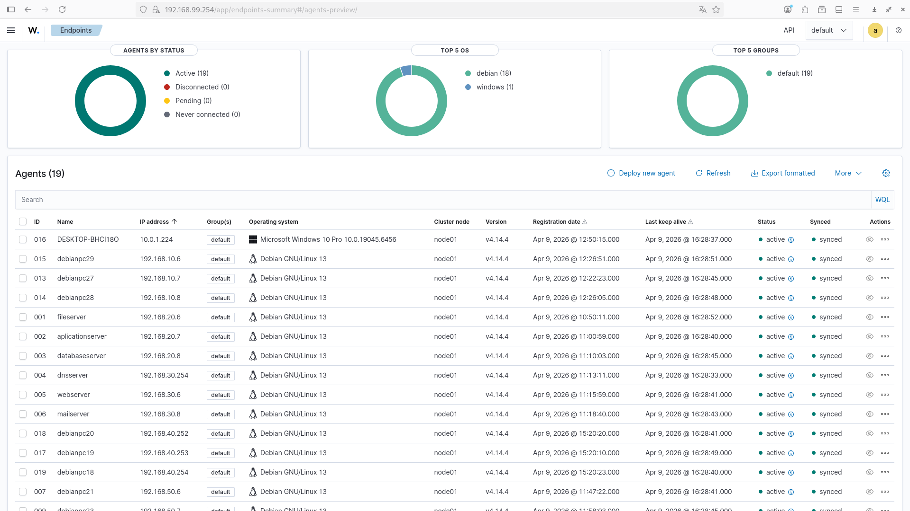

Posteriormente, es posible analizar de forma individual cada host conectado al servidor de Wazuh. Como se muestra en la siguiente imagen, se pueden observar las vulnerabilidades detectadas en el servidor DNS, el cual utiliza el sistema operativo Debian 13 Trixie.

En este caso, el análisis reporta 20 vulnerabilidades críticas, 102 altas, 134 medias, 1 baja y 83 pendientes. Estos resultados evidencian que tanto la instalación del agente como la integración con el servidor se han realizado correctamente, permitiendo la recolección y visualización de información de seguridad.

No obstante, también se pone en evidencia la necesidad de aplicar medidas de endurecimiento (hardening) para asegurar el servidor DNS y mitigar los riesgos detectados.

Cabe destacar que este análisis se realiza únicamente sobre este host, ya que los otros 18 agentes están basados en la misma imagen de Debian 13 Trixie, por lo que presentan métricas de vulnerabilidades similares.

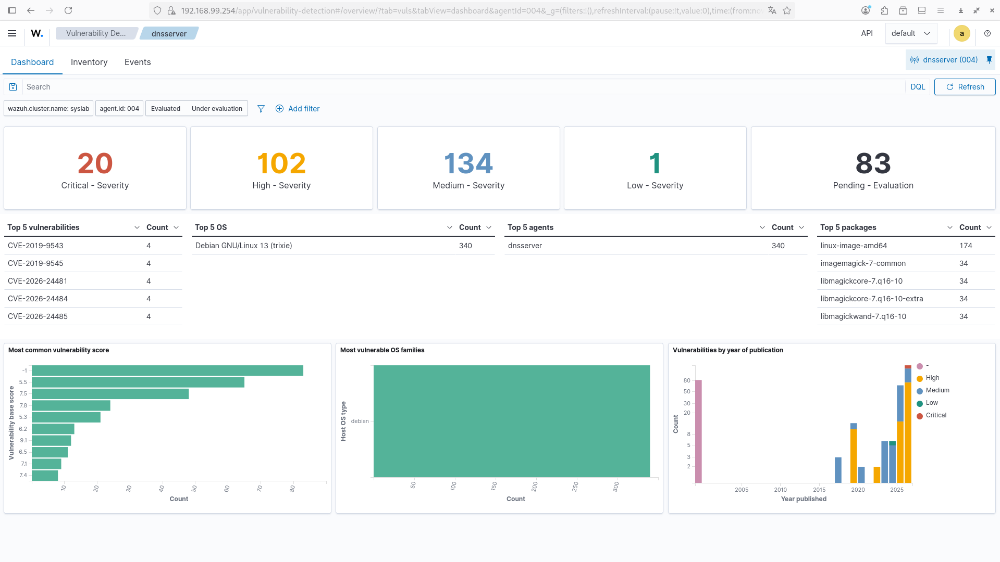

El módulo de detección de malware del servidor de correo dentro de la plataforma Wazuh. En este apartado se evidencian las alertas generadas a partir del análisis de archivos y actividades sospechosas en el sistema. La herramienta permite identificar posibles amenazas como software malicioso, archivos comprometidos o comportamientos anómalos, proporcionando información detallada que facilita la respuesta ante incidentes. Esto demuestra la capacidad del sistema para monitorear de forma continua el servidor de correo y detectar riesgos que podrían comprometer la seguridad de la infraestructura.

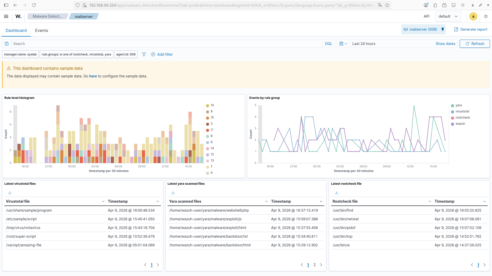

La integración de MITRE ATT&CK dentro de Wazuh, lo que permite clasificar y mapear los eventos de seguridad según tácticas y técnicas utilizadas por posibles atacantes. Esta funcionalidad facilita el análisis contextual de las amenazas, permitiendo comprender mejor el comportamiento del adversario y su ciclo de ataque. Gracias a esta correlación, los administradores pueden priorizar incidentes, mejorar la detección de amenazas avanzadas y fortalecer las estrategias de defensa basadas en estándares reconocidos a nivel mundial.

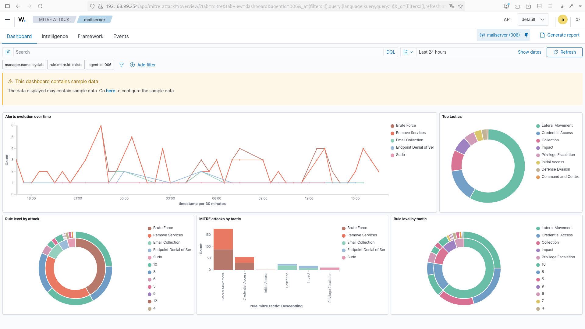

Adicionalmete se observa el módulo de monitoreo de integridad de archivos (File Integrity Monitoring) implementado en Wazuh. Esta funcionalidad permite detectar cambios en archivos críticos del sistema, como modificaciones, eliminaciones o accesos no autorizados. El monitoreo continuo garantiza la integridad de la información y ayuda a identificar posibles actividades maliciosas o errores de configuración. De esta manera, se refuerza la seguridad del entorno, permitiendo una respuesta rápida ante cualquier alteración no prevista en los archivos del sistema.

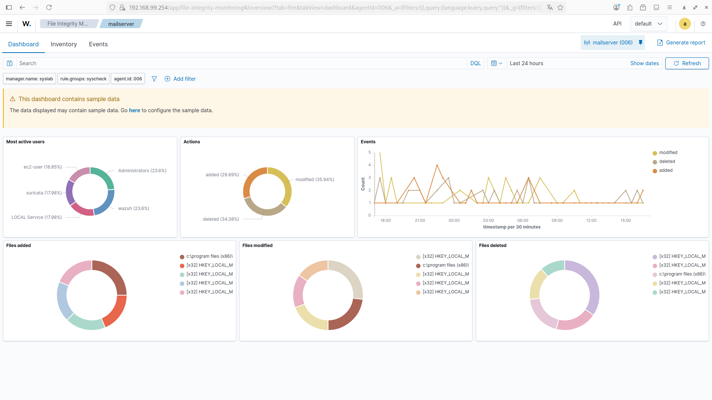

El servidor wazuh presenta muchas mas funcionalidades como el módulo de threat hunting aplicado al servidor DNS. Este enfoque permite realizar búsquedas proactivas de amenazas mediante el análisis de eventos, registros y patrones de comportamiento sospechosos. A través de esta funcionalidad, es posible identificar actividades anómalas que podrían pasar desapercibidas en un monitoreo tradicional, fortaleciendo así la capacidad de detección temprana frente a posibles incidentes de seguridad en el servidor DNS.

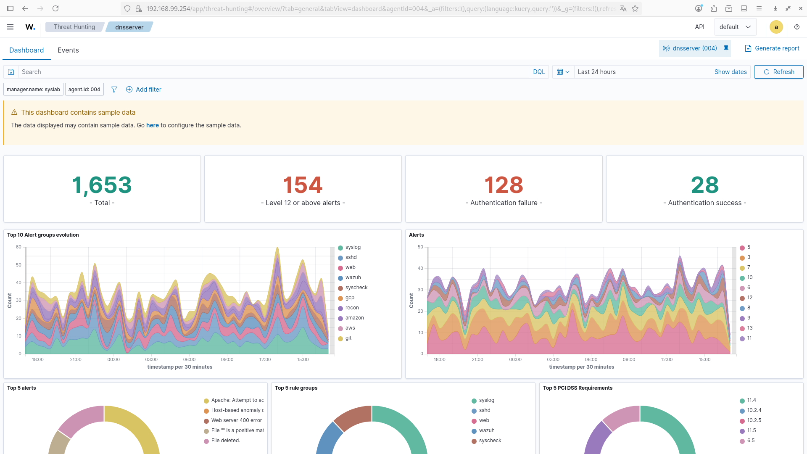

## VERIFICACIONES ADICIONALES

Se evidencia el correcto funcionamiento del servidor DNS, donde se muestran las distintas peticiones realizadas por los clientes. Estas consultas reflejan la resolución de nombres de dominio tanto internos como externos, lo que confirma que el servicio DNS se encuentra operativo y respondiendo adecuadamente a las solicitudes. Este comportamiento garantiza la conectividad y el acceso a los recursos de red, siendo un componente fundamental dentro de la infraestructura implementada.

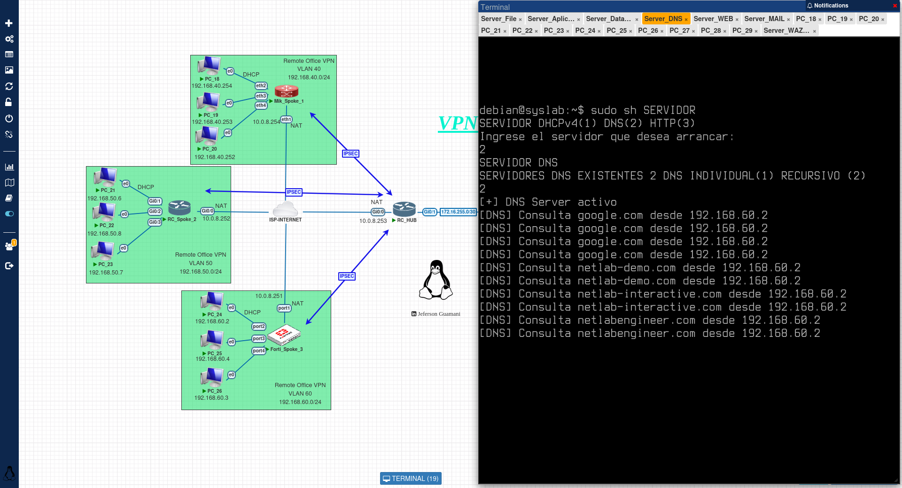

Finalmente, en la tercera imagen se observa que el servidor web se encuentra funcionando correctamente, permitiendo el acceso a los distintos sitios alojados. En este caso, las páginas netlab-demo.com, netlabengineer.com y netlab-interactive.com se cargan de manera exitosa, lo que demuestra que el servicio web está correctamente configurado y disponible para los usuarios. Esto valida la correcta integración de los servicios dentro de la infraestructura y el adecuado funcionamiento de la red.

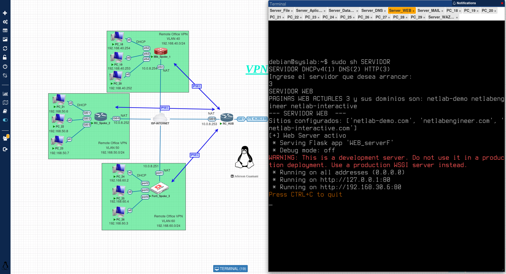

## CONCLUSION 

En conclusión, la implementación del laboratorio permitió integrar de manera exitosa múltiples tecnologías orientadas a la seguridad, segmentación y monitoreo de redes. El uso de una VPN basada en IPsec garantizó la interconexión segura entre la oficina central y las oficinas remotas, permitiendo la transmisión de datos de forma cifrada y transparente para el usuario final.

Asimismo, la segmentación de la red mediante VLANs contribuyó a mejorar la organización y el aislamiento del tráfico, incrementando tanto el rendimiento como la seguridad de la infraestructura. Esta separación lógica permitió gestionar de forma más eficiente los distintos servicios implementados, como el servidor DNS, el servidor web y el servidor de correo.

Por otro lado, la integración de la plataforma Wazuh permitió centralizar el monitoreo y la gestión de eventos de seguridad, facilitando la detección de vulnerabilidades, el análisis de amenazas, el monitoreo de integridad de archivos y la aplicación de técnicas de threat hunting. Esto proporcionó una visibilidad completa del estado de los hosts dentro del entorno, evidenciando tanto su correcto funcionamiento como las áreas que requieren fortalecimiento en términos de seguridad.

En conjunto, la combinación de estas tecnologías demuestra una arquitectura robusta, escalable y orientada a la seguridad, capaz de garantizar la disponibilidad de los servicios, la integridad de la información y la protección frente a posibles amenazas dentro de un entorno empresarial simulado.

## NOTA FINAL
 - [x] Espero que este laboratorio sea de su agrado. Este trabajo representa la integración de conectividad y seguridad en un entorno práctico, basado en escenarios reales y en la implementación de servicios como DNS y HTTP, junto con herramientas de monitoreo como Wazuh.

Este tipo de entornos me resulta especialmente interesante, ya que permite simular infraestructuras reales y comprender de mejor manera el funcionamiento de los distintos componentes dentro de una red empresarial.

Continuaré desarrollando y compartiendo más laboratorios de este tipo. En caso de que les pueda surjir alguna duda sobre la implementación o configuración, no duden en ponerse en contacto para poder brindar el apoyo necesario.

